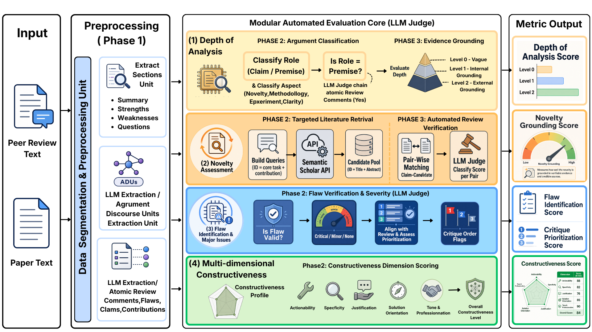
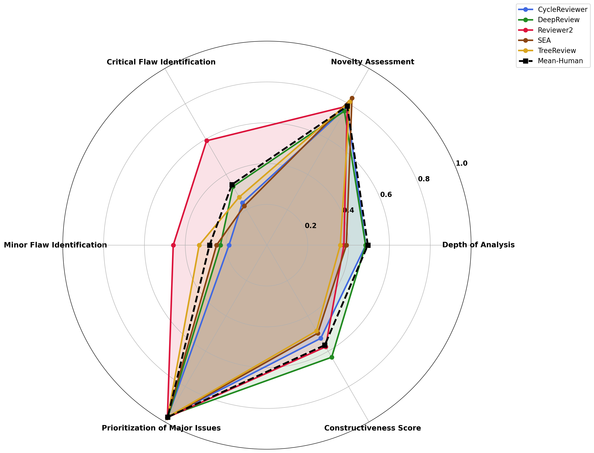
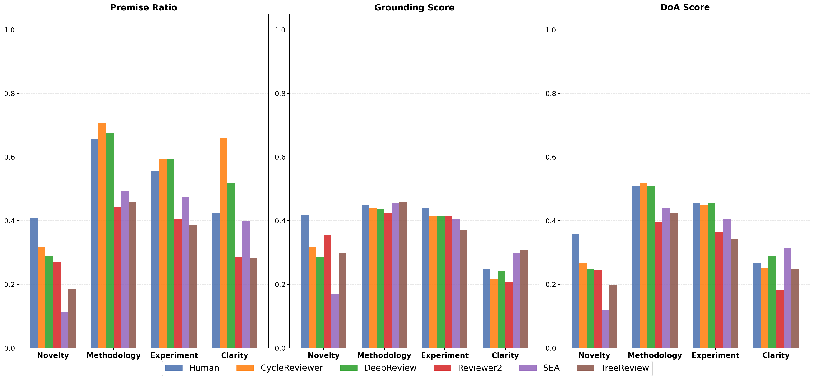
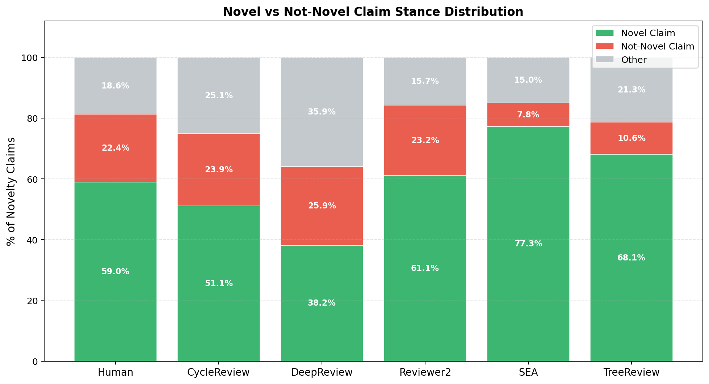
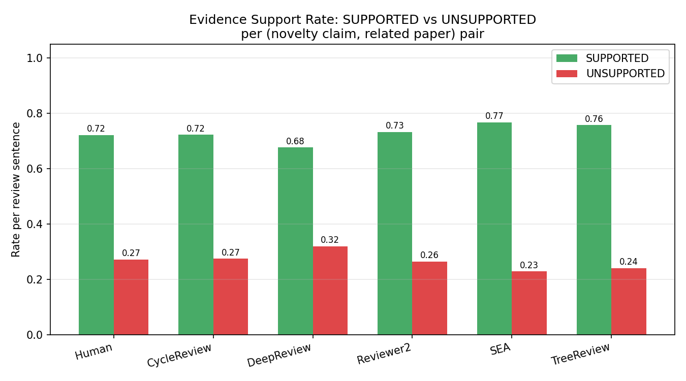
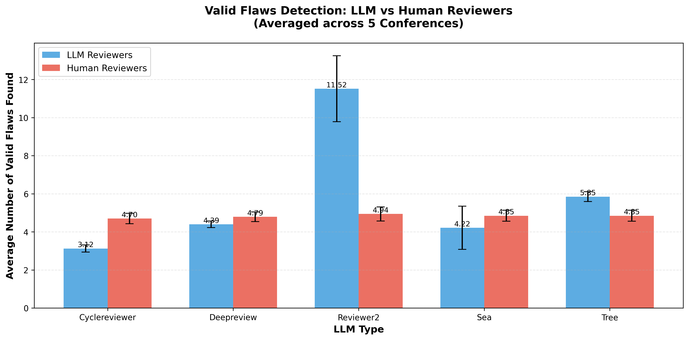
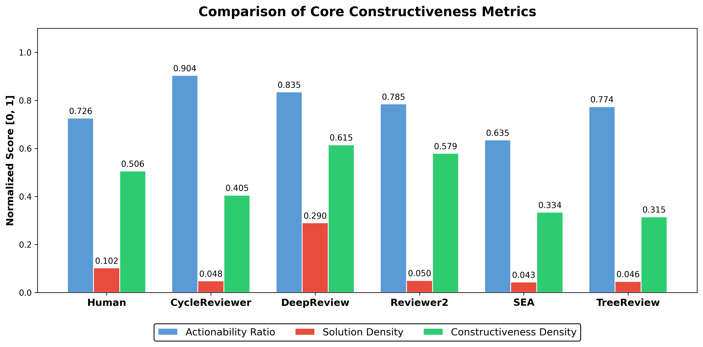

# PRISM: A Multi-Dimensional Benchmark for Evaluating LLM Peer Reviewers

> **Can LLMs review scientific papers as well as humans — and can they identify gaps that overloaded human reviewers miss?**

PRISM (**P**eer **R**eview **I**ntelligence via **S**tructured **M**ulti-dimensional assessment) is a benchmark for evaluating the *reviews themselves*, not the papers being reviewed. Instead of asking an LLM judge for one holistic score, PRISM decomposes review quality into traceable evidence-extraction pipelines and computes scores analytically.

The benchmark compares human reviewers with five automated reviewer systems — **CycleReviewer**, **DeepReview**, **Reviewer2**, **SEA**, and **TreeReview** — on **1,000 machine-learning papers** sampled from ICLR, ICML, and NeurIPS.

**Main takeaway:** LLM reviewers are best understood as *specialized co-pilots*. Some are strong flaw scanners, some produce better constructive feedback, and some ground novelty claims well — but no single system matches the balanced profile of human reviewers across all dimensions.

## Links

- **Paper:** TODO: add arXiv / OpenReview link
- **Code:** TODO: add GitHub link
- **Dataset:** TODO: add dataset / Hugging Face link
- **Demo:** TODO: add interactive demo link
- **Poster / Slides:** TODO: add presentation materials

## Why PRISM?

Submission volume at major ML venues is increasing rapidly, putting pressure on reviewer pools and paper-reviewer matching. At the same time, LLMs are already being used to help draft scientific reviews. Existing evaluation methods often rely on surface metrics or unconstrained LLM-as-a-judge prompts, which can reward fluent writing even when a review misses major scientific flaws.

PRISM asks a stricter question:

> Does a review provide grounded analysis, calibrated novelty judgment, valid flaw detection, and actionable feedback?

To answer this, PRISM evaluates each review along four dimensions aligned with the responsibilities of scientific peer review.

## Method Overview

PRISM first segments each manuscript and review into structured units, then routes the review through four modular pipelines. The LLM judge is used for constrained extraction and labeling tasks; final scores are computed from those labels rather than from a single subjective rating.

| Dimension | What PRISM Measures | Key Output |
| --- | --- | --- |
| **Depth of Analysis** | Whether review claims are supported by concrete premises rather than generic assertions. | Premise ratio, grounding score, aspect distribution. |
| **Novelty Assessment** | Whether novelty claims are supported or contradicted by retrieved prior work. | Evidence-grounded novelty score and stance distribution. |
| **Flaw Identification & Prioritization** | Whether critiques are valid, hallucinated, critical, minor, and properly prioritized. | Critical/minor flaw recall and normalized critique prioritization score. |
| **Multi-dimensional Constructiveness** | Whether feedback is actionable, specific, justified, solution-oriented, and professional. | Constructiveness score and D1–D5 sub-dimension profile. |

### Pipeline Details

1. **Depth of Analysis:** PRISM atomizes the review into argumentative discourse units, classifies each unit as a claim or premise, assigns an aspect topic such as methodology or experiments, and scores the grounding level from vague to externally supported.
2. **Novelty Assessment:** PRISM extracts novelty-related claims, retrieves related literature, and checks whether each claim is supported, contradicted, or insufficiently evidenced.
3. **Flaw Identification:** PRISM extracts review criticisms, verifies whether each flaw is valid or hallucinated, labels severity, and measures whether major issues are placed before minor comments.
4. **Constructiveness:** PRISM breaks feedback into atomic review comments and scores each one across five dimensions: actionability, specificity, justification, solution provision, and tone.

## Experimental Setup

PRISM evaluates **1,000 papers**, with 200 papers from each venue-year split:

| Venue-Year | Papers | Decision Strata |
| --- | ---: | --- |
| ICLR 2024 | 200 | Oral, Spotlight, Poster, Reject |
| ICLR 2025 | 200 | Oral, Spotlight, Poster, Reject |
| ICLR 2026 | 200 | Oral, Poster, Reject |
| ICML 2025 | 200 | Oral, Spotlight, Poster, Reject |
| NeurIPS 2025 | 200 | Oral, Spotlight, Poster, Reject |

**Automated reviewer baselines:**

- **CycleReviewer** — iterative review generation and revision.
- **DeepReview** — multi-stage, deep-reasoning review generation.
- **Reviewer2** — prompt-optimized automated review generation.
- **SEA** — supervised scientific-review generation.
- **TreeReview** — tree-structured review generation.

**Human baseline:** official human reviews associated with the sampled papers.

## Main Results

| Evaluation Dimension | Best Automated System | Human Baseline | Key Finding |
| --- | ---: | ---: | --- |
| **Depth of Analysis** | CycleReviewer: **0.484**; DeepReview: **0.483** | **0.494** | The strongest LLMs nearly match humans by producing many substantiated premises, but humans remain slightly more balanced. |
| **Novelty Assessment** | SEA: **0.833** | **0.787** | Automated systems can produce novelty claims that are well grounded in retrievable literature, but this does not guarantee human-level novelty judgment. |
| **Critical Flaw Recall** | Reviewer2: **0.591** | **0.343** | Reviewer2 acts as a high-sensitivity flaw scanner, surfacing more valid critical issues than humans. |
| **Minor Flaw Recall** | Reviewer2: **0.459** | **0.281** | The same exhaustive-scanning behavior also finds more minor issues. |
| **Prioritization** | SEA: **0.977** | **0.973** | Nearly all systems prioritize critical issues before minor comments; this is a baseline behavior, not a unique model advantage. |
| **Constructiveness** | DeepReview: **0.634** | **0.566** | DeepReview produces the most actionable and solution-oriented feedback. |

### Key Findings

- **No single LLM reviewer dominates all dimensions.** Each system has a specialization profile and distinct blind spots.
- **LLMs can be strong diagnostic scanners.** Reviewer2 finds substantially more valid critical and minor flaws than the human baseline.
- **Grounded novelty is not the same as expert novelty judgment.** SEA scores highly because its novelty claims are easily verifiable, but claim selection and calibration still differ from humans.
- **Human-level depth requires more than verbosity.** The best systems achieve depth by increasing premise density and focusing on methodology and experiments, not by producing longer reviews.
- **Constructiveness depends on system design.** DeepReview closes the loop from “this is a problem” to “here is how to fix it,” while humans often stop at diagnosis.

## Figure Highlights

### 1. Depth of Analysis

Human reviewers set the strongest overall depth baseline. DeepReview and CycleReviewer approach this level by producing high premise ratios and aligning their attention with human reviewers: methodology and experiments receive the majority of analytical effort. TreeReview falls into a **surface-level trap**, spending too much attention on clarity and reproducibility boilerplate.

### 2. Novelty Assessment

Automated reviewers often generate novelty claims that can be grounded in retrieved prior work. However, systems differ strongly in stance. SEA tends to endorse novelty more often, while DeepReview is more skeptical and searches for counter-evidence.

### 3. Flaw Identification

Reviewer2 recovers the highest number of valid flaws, especially critical flaws. Importantly, hallucinated flaws are confined to minor issues in the paper’s analysis: no human or LLM reviewer fabricates a critical methodological breakdown.

### 4. Constructiveness

DeepReview leads on actionability and solution density. Human reviewers are often specific and technically perceptive, but they frequently identify problems without proposing concrete remedies.

## Qualitative Assessment

PRISM includes case studies that make the metric behavior interpretable. Each case links a reviewer’s text to extracted units, judge labels, and final metric consequences.

### Case Study A: Depth of Analysis on NV-Embed

**Paper:** *NV-Embed: Generalist Text Embeddings from Decoder-Only LLMs* (ICLR 2025)

| Reviewer | DoA | Premise Ratio | Avg. Grounding | What Happened |
| --- | ---: | ---: | ---: | --- |
| Human | 0.581 | 0.673 | 0.500 | Dense, component-specific technical grounding. |
| DeepReview | **0.626** | **0.733** | **0.546** | Fewer comments, but most are grounded premises. |
| Reviewer2 | 0.178 | 0.152 | 0.215 | Many claims, few independently grounded premises. |

**Interpretation:** Reviewer2 writes a long review, but PRISM penalizes it because most units are claim-like summaries rather than evidence-backed premises. DeepReview performs well because it is concise but grounded.

### Case Study B: The Surface-Level Trap on VLAP

**Paper:** *VLAP: Visual-Language Alignment via Pre-trained Word Embeddings* (ICLR 2024)

TreeReview allocates **29%** of its premise budget to clarity/reproducibility comments, even though most other reviewers allocate almost none. The result is a low DoA score of **0.252**, compared with the human mean of **0.567**.

Representative low-grounding critique:

> “This would greatly enhance the reproducibility of the method.”

**Interpretation:** The issue is not that the paper is unclear. The issue is that TreeReview’s reviewing heuristic triggers generic reproducibility comments even when the paper’s simple design does not warrant them.

### Case Study C: Complementary Flaw Detection

**Paper:** ICML 2025 oral paper on a preconditioning-based optimizer for domain generalization.

Human reviewers and Reviewer2 each find roughly nine unique valid flaws, with near-zero overlap. Reviewer2 is strongest at equation-level scrutiny, while humans are strongest at claim-evidence calibration and field norms.

| Reviewer Group | Strength | Example Pattern |
| --- | --- | --- |
| Reviewer2 | Systematic theory and notation checks. | Questions assumptions in PAC-Bayes derivations and gradient-independence claims. |
| Humans | Practical and community-aware assessment. | Demands feature-level evidence for domain-invariance claims. |

**Interpretation:** Human and LLM reviewers are complementary. Their union covers more diagnostic ground than either group alone.

### Case Study D: Constructiveness on GenColor

**Paper:** *GenColor: A Diffusion-Based Framework for Color Enhancement in Digital Photography* (NeurIPS 2025)

| Reviewer | MCS | Actionability | Specificity | Solution | What Happened |
| --- | ---: | ---: | ---: | ---: | --- |
| Human | 0.488 | 0.721 | 1.767 | 0.326 | Specific diagnosis, few concrete fixes. |
| DeepReview | **0.724** | **1.588** | **2.000** | **1.059** | Converts critique into implementable recommendations. |

Human reviewers correctly identify problems such as determinism, runtime, and dataset scope. DeepReview addresses similar concerns but adds prescriptive next steps, such as ablation studies, computational-cost analysis, and clearer novelty articulation.

**Interpretation:** High constructiveness is not just nicer tone or longer text. It requires closing the feedback loop from diagnosis to prescription.

## What PRISM Reveals About LLM Reviewers

PRISM reframes the role of automated reviewers:

- Use **Reviewer2** for exhaustive flaw scanning.
- Use **DeepReview** for constructive feedback drafting.
- Use **SEA** for literature-grounded novelty checks.
- Use **humans** for balanced judgment, domain norms, and final decision-making.

The safest deployment is therefore not autonomous replacement, but a **targeted ensemble** in which LLM systems act as specialist co-pilots inside a human-led review process.

## Related Work and Demos to Reference

PRISM is designed to be presented like a benchmark website: method diagram first, headline metrics, qualitative cards, and links to related systems. Useful references for positioning and website structure include:

- [LM Arena / Chatbot Arena](https://lmarena.ai/) and [MT-Bench / Chatbot Arena](https://arxiv.org/abs/2306.05685): clear public-facing benchmark framing, leaderboard-style reporting, and interpretable pairwise comparisons.
- [SWE-bench](https://swebench.com/): benchmark website with concise task definition, headline results, leaderboard navigation, and downloadable artifacts.
- [Reviewer2](https://arxiv.org/abs/2402.10886): prompting-based automated review generation.
- [SEA](https://aclanthology.org/2024.findings-emnlp.595/): supervised scientific-review generation.
- [DeepReview](https://arxiv.org/abs/2503.08569): deep-reasoning paper review generation with public demo material.
- [TreeReview](https://aclanthology.org/2025.emnlp-main.790/): tree-structured review generation.
- [CycleResearcher / CycleReviewer](https://arxiv.org/abs/2411.00816): iterative agentic research and review generation.

## Suggested Website Layout

1. **Hero:** title, one-sentence pitch, paper/code/demo buttons.
2. **Problem:** why peer review needs structured evaluation.
3. **Method:** PRISM overview diagram and four metric cards.
4. **Benchmark:** dataset, venues, baselines, and judge setup.
5. **Results:** main table, radar plot, and one key finding per dimension.
6. **Qualitative Cases:** human vs. LLM review examples with judge-label breakdowns.
7. **Deployment Guidance:** recommended specialist use of Reviewer2, DeepReview, and SEA.
8. **Citation:** BibTeX entry once available.

